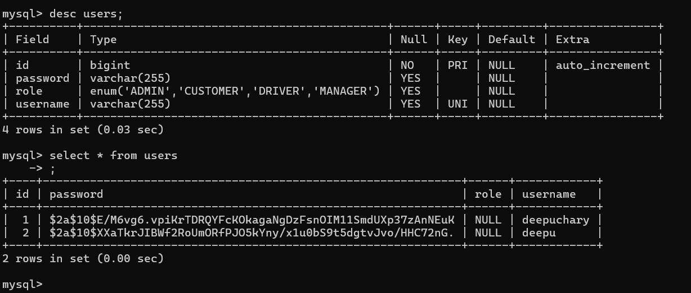

# Springboard-Auth-Practice
 ## checking the endpoints with Postman
 
 ## Details stored in the database
  
 # Demonstration  
[Click here to view the Video (execution)](https://www.linkedin.com/posts/deepuchary03_springboot-mysql-postman-activity-7376652855144857600-j5Uf?utm_source=share&utm_medium=member_desktop&rcm=ACoAAE42qdkB_Akn5u_1EK9198sWAOjY5wL1-Bc)

